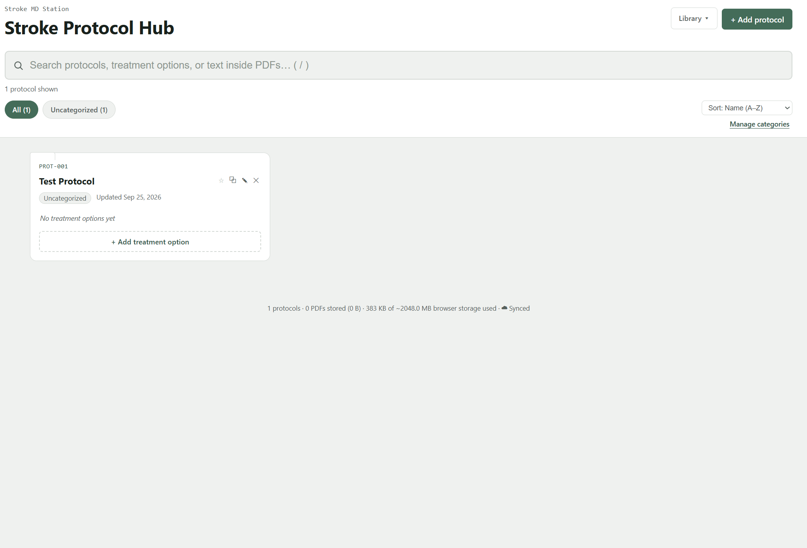
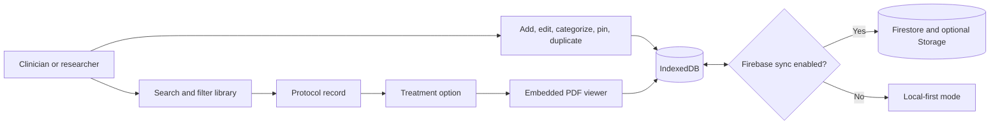
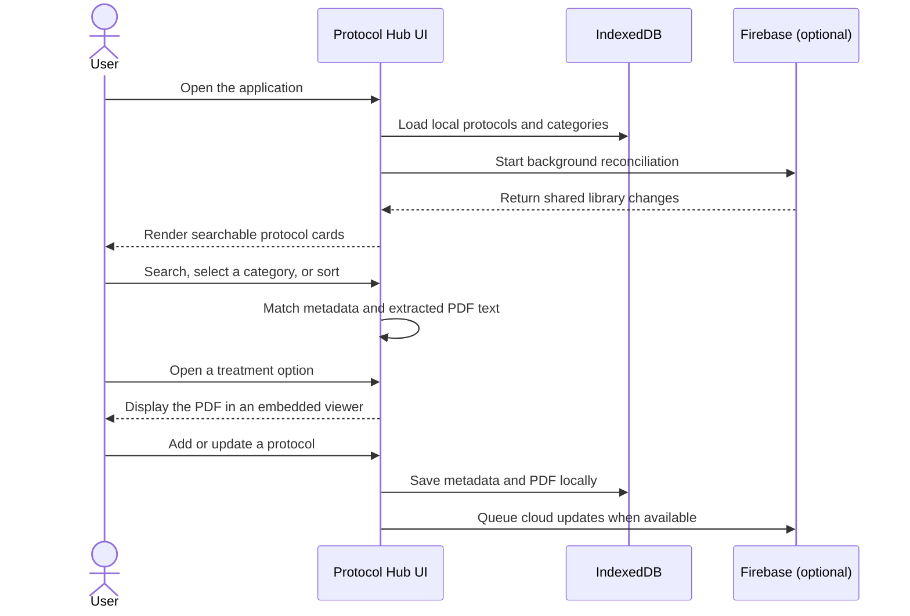
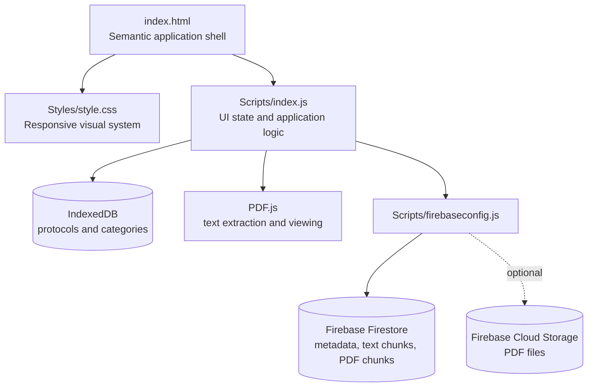

# Clinical Protocol Hub

### A searchable, offline-friendly workspace for managing clinical protocols and treatment PDFs

## Project Overview

Clinical Protocol Hub is a browser-based knowledge library for organizing clinical protocols, treatment options, and the PDF documents that support them. It is designed around a common workplace problem: important protocol information can be scattered across folders, files, and shared drives, making it slow to find the right document when it is needed.

The application gives a clinical or research team one focused place to:

- Search protocol names, treatment options, categories, and extracted PDF text.
- Open treatment documents in an in-app PDF viewer.
- Add, edit, duplicate, pin, categorize, and remove protocols.
- Work with a local IndexedDB copy, including offline access to cached PDFs.
- Export a complete library to JSON and import it on another device.
- Synchronize protocol metadata, categories, extracted text, and PDFs through Firebase when configured.

This repository demonstrates practical frontend engineering, browser storage, file handling, search indexing, cloud synchronization, and progressive enhancement in a small, dependency-light application.

## How It Works

### Typical user workflow

## Feature Highlights

### Fast information retrieval

- Full-text search across protocol names, treatment option names, category names, and text extracted from PDFs.
- Category chips, recently viewed items, pinned protocols, and alphabetical or recently updated sorting.
- Empty states and result counts that make search behavior clear.

### Protocol and document management

- Create and edit protocol records with unique names and categories.
- Attach one or more PDF treatment options to each protocol.
- Replace, view, open in a new tab, or remove treatment PDFs.
- Duplicate an existing protocol as a starting point for a related workflow.
- Rename and delete categories with an undo path for accidental changes.

### Local-first resilience

- IndexedDB keeps the working library in the browser instead of depending on a network request for every interaction.
- PDFs can be cached locally and opened offline after they have been downloaded.
- The interface loads local data immediately while cloud synchronization continues in the background.
- Export and import provide a portable backup and migration path.

### Cloud synchronization

- Firebase Firestore stores protocol metadata, categories, and chunked extracted PDF text.
- PDF data is chunked when stored in Firestore so it stays below document size limits.
- Optional Firebase Cloud Storage support is available for deployments using the Blaze plan.
- Local and cloud records are reconciled on startup and when cloud snapshots change.
- Sync status and upload/download problems are surfaced in the application footer.

## Technical Design

### Repository structure

| Path | Purpose |
| --- | --- |
| `index.html` | Application layout, modal forms, search controls, and PDF viewer shell |
| `Scripts/index.js` | IndexedDB persistence, search, PDF processing, UI behavior, import/export, and Firebase synchronization |
| `Scripts/firebaseconfig.js` | Firebase web configuration entry point |
| `Styles/style.css` | Responsive styling, accessibility focus states, cards, modals, filters, and viewer layout |
| `README.md` | Project documentation and implementation notes |

## Build Process

This project was built incrementally around a local-first data model:

1. **Define the workflow**: identify the core objects as protocols, categories, treatment options, and attached PDFs.
2. **Build the usable shell**: create a responsive library view with search, filters, cards, modals, and an embedded viewer.
3. **Add durable browser storage**: use IndexedDB so the main workflow remains available without a server round trip.
4. **Make PDFs searchable**: use PDF.js to extract document text and include it in the search index.
5. **Add team workflows**: support categories, recently viewed items, pinning, duplication, import, and export.
6. **Add cloud synchronization**: reconcile the local copy with Firestore and transfer PDF/text content in size-safe chunks.
7. **Add failure handling**: show sync and PDF errors, preserve local data when cloud services are unavailable, and provide an offline fallback.
8. **Prepare for deployment**: configure Firebase rules, authentication, hosting, backups, and privacy controls before using real clinical data.

The implementation intentionally uses plain HTML, CSS, and JavaScript. That keeps the prototype easy to inspect, deploy as static files, and extend without a build pipeline.

## Firebase Setup

Cloud synchronization is optional. The current `Scripts/firebaseconfig.js` contains placeholder values, so the app will operate in local-only mode until a Firebase web app is configured.

1. Create a Firebase project and a Web App.
2. Enable Firestore.
3. Copy the web configuration into `Scripts/firebaseconfig.js`.
4. Configure Firestore security rules and, if used, Cloud Storage rules.
5. Set `USE_CLOUD_STORAGE` in `Scripts/index.js` to `true` only when Cloud Storage and the required billing plan are available.
6. Test with non-sensitive sample documents before considering a production deployment.

The Firebase web configuration is not an authentication secret, but database and storage rules are security boundaries. This prototype does not include user authentication or role-based access control.

## Employer-Facing Value

This project is a compact example of how I approach product engineering:

- **User-centered workflow design**: the primary action is finding and opening the right source document quickly.
- **Resilient application behavior**: local persistence keeps the core workflow useful when connectivity is unreliable.
- **Practical data modeling**: metadata, extracted text, and binary PDF content are stored according to their different size and access patterns.
- **Progressive enhancement**: the application is useful without cloud services and becomes collaborative when Firebase is configured.
- **Operational awareness**: sync states, storage usage, upload failures, and offline conditions are visible instead of being silently ignored.
- **Maintainable scope**: the project uses a small, understandable technology surface that can be reviewed and deployed quickly.

## Production Readiness Roadmap

Before using this application with real patient, trial, or protected health information, the next engineering steps would be:

- Add Firebase Authentication and role-based authorization.
- Define and test least-privilege Firestore and Storage rules.
- Add automated unit, integration, and browser tests.
- Add audit logging for document access and changes.
- Add validation for file size, MIME type, and malicious uploads.
- Move sensitive configuration and environment-specific settings into a deployment process.
- Add backups, retention policies, monitoring, and documented incident procedures.
- Evaluate compliance requirements for the intended organization and data.

## Current Limitations

- Authentication and multi-user permissions are not implemented.
- Firebase configuration is intentionally left as a placeholder.
- The application currently uses a single shared cloud hub when Firebase is enabled.
- Large PDF libraries may approach browser storage or Firestore quota limits.
- Automated test coverage and deployment configuration are not included in this prototype.

## License and Data Notice

No license has been specified for this repository. Confirm ownership and licensing before distributing it. Do not upload real clinical or personally identifiable information until the security, privacy, and compliance controls required by the deployment environment are in place.
